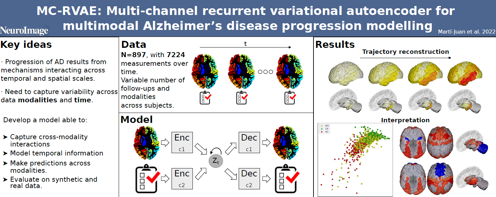

## MC-RVAE README

This repository contains code for the paper "MC-RVAE: Multi-channel recurrent variational autoencoder for multimodal
Alzheimer’s disease progression modelling".

### Abstract

The progression of neurodegenerative diseases, such as Alzheimer's Disease, is the result of complex mechanisms interacting across multiple spatial and temporal scales. 
Understanding and predicting the longitudinal course of the disease requires harnessing the variability across different data modalities and time, which is extremely challenging. 
In this paper, we propose a model based on recurrent variational autoencoders that is able to capture cross-channel interactions between different modalities and model temporal information. These are achieved thanks to its multi-channel architecture and its shared latent variational space, parametrized with a recurrent neural network. 
We evaluate our model on both synthetic and real longitudinal datasets, the latter including imaging and non-imaging data, with N=897 subjects. 
Results show that our multi-channel recurrent variational autoencoder outperforms a set of baselines (KNN, random forest, and group factor analysis) for the task of reconstructing missing modalities, reducing the mean absolute error by $5\%$ (w.r.t. the best baseline) for both subcortical volumes and cortical thickness. Our model is robust to missing features within each modality and is able to generate realistic synthetic  imaging biomarkers trajectories from cognitive scores.

### Table of contents:

* evaluation/: scripts to evaluate the results. Contains some Jupyter notebooks to generate figures, and Python scripts to test the results.
* rnnvae/: main scripts of the method. Contains the definition of the model and supporting functions. It has 3 different definitions of the model:
  * rnnvae: Full model.
  * rnnvae_h: Model with sharing the RNN and prior part.
  * rnnvae_s: Model without phi_x and phi_z functions.  <-- CURRENT, MOST ADVANCED MODEL. IGNORE THE COMMENTS

### Scripts folder:

* scripts_mc/: Scripts for testing with synthetic and real brain data, using rnnvae.
* scripts_mc_moreparams/: Scripts for testing with synthetic and real brain data, using rnnvae_h and with separated parameters.
* scripts_small/: Scripts for testing with synthetic and real brain data, using rnnvae_s.

### References

If you use this code for your research, please cite our paper:

Martí-Juan, G., Lorenzi, M., Sanroma-Guell, G., et al. (2023). *MC-RVAE: Multi-channel recurrent variational
autoencoder for multimodal Alzheimer’s disease progression modelling*. NeuroImage. DOI:
[10.1016/j.neuroimage.2023.119892](https://doi.org/10.1016/j.neuroimage.2023.119892)
